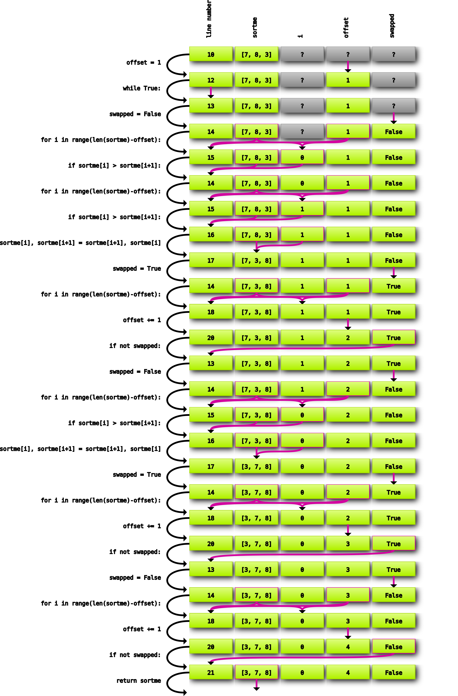
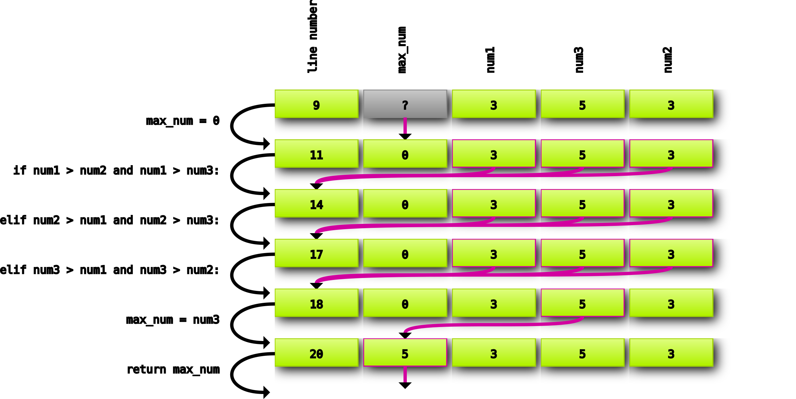

# PrintState
Python script to print program state of python functions

## Example - Bubblesort

Given the following bubblesort program

    def bubblesort(sortme):
        offset = 1

        while True:
            swapped = False
            for i in range(len(sortme)-offset):
                if sortme[i] > sortme[i+1]:
                    sortme[i], sortme[i+1] = sortme[i+1], sortme[i]
                    swapped = True
            offset += 1

            if not swapped:
                return sortme

    if __name__ == "__main__":
        bubblesort([7,8,3])

This will generate the follown svg image:

## Example - Findmax

Given the following find max program (with bug):

    def find_max(num1, num2, num3):

        max_num = 0

        if num1 > num2 and num1 > num3:
            max_num = num1

        elif num2 > num1 and num2 > num3:
            max_num = num2

        elif num3 > num1 and num3 > num2:
            max_num = num3

        return max_num

    if __name__ == "__main__":
        find_max(3,3,5)

This will generate the follown svg image:

